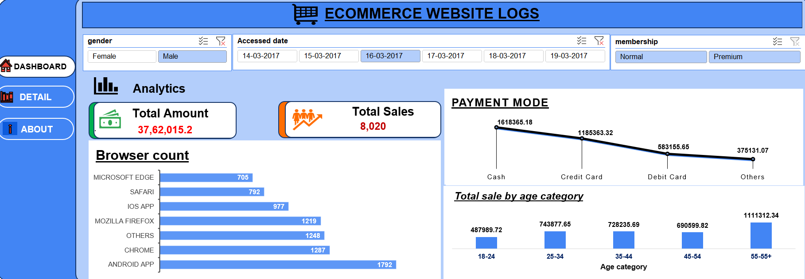
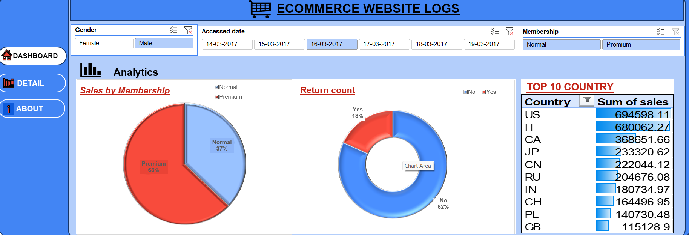

# 🛒 Ecommerce Website Logs Analysis (Excel Dashboard)

## 📌 Project Overview  
This project is based on an Ecommerce Website Logs dataset analyzed using Microsoft Excel.

In this project, I cleaned and analyzed user activity data to understand:
- customer behavior  
- sales performance  
- product returns  

The goal is to generate useful insights that can help improve business decisions.

---

## 📂 Dataset Information  

- Original Data: 99,458 rows, 16 columns  
- After Cleaning: 84,715 rows, 11 columns  
- Tool Used: Microsoft Excel  

---

## 📑 Columns Used  

- Accessed Date  
- Accessed From  
- Age  
- Age Category (created column)  
- Gender  
- Country  
- Membership  
- Sales  
- Returned  
- Returned Amount  
- Payment Method  

---

## 🧹 Data Cleaning  

- Removed duplicate and unnecessary data  
- Handled missing values  
- Standardized formats  
- Created Age Category column for better analysis  

---

## 📊 Key Insights  

### 📈 Sales Analysis  
- Sales based on membership type  
- High contribution from premium users  

### 🔁 Returns Analysis  
- Identified return patterns  
- Analyzed returned amount impact  

### 🌍 Country Analysis  
- Top countries generating maximum sales  

### 🌐 Platform Analysis  
- Compared Browser vs App usage  

### 👥 Age Analysis  
- Sales performance by age group  

---

## 🛠 Tools & Skills  

- Microsoft Excel  
- Data Cleaning  
- Pivot Tables  
- Data Analysis  
- Dashboard Creation  

---

## 📷 Dashboard Preview  

### Dashboard 1  

### Dashboard 2  

---

## 🎯 What I Learned  

- How to clean real-world data  
- How to use Excel for analysis  
- How to create dashboards  
- How to find business insights from data  

---

## 👩‍💻 Author  

Puja Kumari  
Aspiring Data Analyst  
